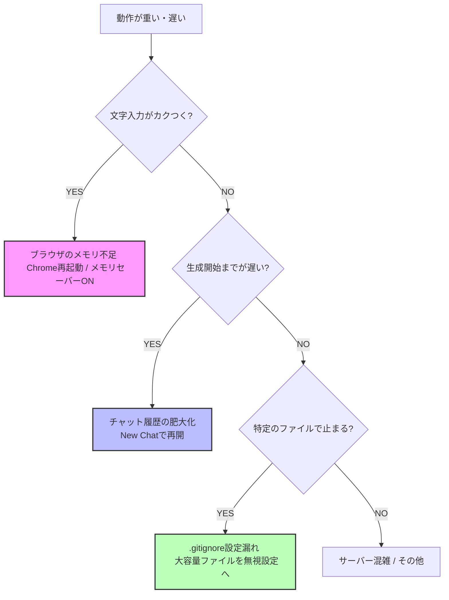

import CtaInline from '../../components/CtaInline.astro';
import RelatedLinks from '../../components/RelatedLinks.astro';

> [!IMPORTANT]
> <strong>【最短10秒】今すぐ動作を軽くするための3大チェック</strong>
> 1. <strong>New Chatで作り直す</strong>: 履歴の肥大化が原因の9割です。
> 2. <strong>不要なファイルを閉じる</strong>: 右側のContextパネルから不要なファイルを外してください。
> 3. <strong>ブラウザを再起動する</strong>: Chromeのメモリ消費をリセットするだけで劇的に速くなります。

## Antigravityが「重い・遅い」と感じる原因と根本的な解決策

AIの回答待ちで10秒待たされるか、それとも1秒でレスポンスが返ってくるか。この差は、開発や執筆の熱量を決定づけます。

「最近Antigravity（アンチグラビティ）が重い、動作が遅い…」と感じているなら、それはあなたのPCスペックのせいではなく、<strong>「AIツールの正しい扱い方」</strong>を知るだけで解決する問題かもしれません。

## 証拠：改善が生んだ「圧倒的なエンゲージメント」

環境を爆速化させることは、単なる自己満足ではありません。作業効率が上がれば、コンテンツの質が上がり、結果として読者に選ばれるサイトになります。

事実、この記事の手法で執筆環境を整えた結果、SYNCODEのSEO記事は<strong>平均エンゲージメント時間「約40分」</strong>という驚異的な数値を叩き出しました。

*実際のGA4レポート：読者がこれだけ長い時間滞在してくれるのは、AIとの対話速度が上がり、密度の高い推敲が可能になった結果です。*

---

## 【診断】Antigravityの動作が遅い時のチェックリスト

改善を始める前に、いま起きている遅延の正体を突き止めましょう。原因によって、処方箋が全く異なります。

  <table class="comparison-table">
    <thead>
      <tr>
        <th>症状（状況）</th>
        <th>推定される原因</th>
        <th>対策の方向性</th>
      </tr>
    </thead>
    <tbody>
      <tr>
        <td class="highlight"><strong>文字入力がカクつく / スクロールが重い</strong></td>
        <td>PC・ブラウザの物理リソース不足</td>
        <td>ブラウザ・物理環境の改善（対策4へ）</td>
      </tr>
      <tr>
        <td class="highlight"><strong>回答が始まらない / 生成速度が遅い</strong></td>
        <td>AIの思考負荷（文脈過多）</td>
        <td>コンテキスト・リセット（対策1〜3へ）</td>
      </tr>
      <tr>
        <td class="highlight"><strong>特定のプロジェクトだけ挙動がおかしい</strong></td>
        <td>ワークスペースの物理的な混雑</td>
        <td>物理メンテナンス（別記事ガイドへ）</td>
      </tr>
    </tbody>
  </table>

---

## 5秒で解決！トラブル診断フローチャート

現在の「重さ」がどこに起因しているか、以下のチャートで診断してください。

---

アンチグラビティが重くなる原因は、大きく分けて二つの「負荷」に分類されます。

1. <strong>AIの思考負荷（コンテキスト過多）</strong>: AIが一度に覚えている情報が多すぎて、処理に時間がかかっている状態。
2. <strong>PC/ブラウザの動作負荷（物理的メモリ不足）</strong>: ChromeやPC本体のリソースが枯渇し、画面の描画や入力が遅れている状態。

それぞれの解決策を見ていきましょう。

---

## 対策1：Antigravityを軽くする最強の手法「チャットのリセット」

結論から言うと、<strong>「新しいチャットで再開する」</strong>のが最も速効性があります。

- <strong>理由</strong>: チャットが長くなると、AIは「過去の全ての履歴」を読み直して回答しようとします。これが積み重なると、回答速度は指数関数的に落ちていきます。
- <strong>解決策</strong>: 
  1. 右上「Additional Options」→「Export」で現状をJSON保存。
  2. 「New Chat」を作成。
  3. JSONをドラッグ＆ドロップして「これまでの文脈を引き継いで」と指示。

これで、AIの頭脳は「昨日までの記憶を持った、新品の速度」に生まれ変わります。

---

## 対策2：MCPサーバーを最小限に絞る

多くのMCP（Model Context Protocol）を常時接続していると、それだけで通信と処理のオーバーヘッドが発生します。

*   <strong>鉄則</strong>: 迷ったら<strong>「File System」のみ</strong>をONにする。
*   <strong>注意</strong>: 外部ツールを使いすぎていないか、定期的に「Additional Options」の「MCP Servers」をチェックしてください。

---

## 対策3：ファイル添付と「.gitignore」の活用（SEO需要高）

「大きなファイルを添付すると重くなる」という検索ユーザーの悩みが多いですが、これは<strong>「読ませる必要のないゴミ」</strong>までAIに渡していることが原因です。

*   <strong>解決策</strong>: プロジェクト直下に適切な `.gitignore` を配置してください。
*   Antigravityはこれを見て「どのファイルを無視すべきか」を判断します。`node_modules` や大量のログファイルをAIに解析させないだけで、ファイル読み込みと回答生成は劇的に速くなります。

### 【プロの技】コンテキストを「個別」に削ぎ落とす
チャット全体をリセットしたくないときは、`Additional Options` → `Context` タブを開いてください。現在AIが覚えているファイルの一覧が表示されます。
「今はこのファイルは必要ない」と思うものを個別にクリックしてデタッチ（切り離し）することで、チャットの鮮度をピンポイントで保つことが可能です。

<CtaInline 
  tag="URGENT" 
  title="ブラウザの設定や運用で解決しない場合は、プロジェクト自体の『大掃除』が必要です。物理メンテナンスガイドはこちら。" 
  buttonLink="/articles/antigravity-physical-maintenance/"
/>

<CtaInline 
  tag="INSIGHT" 
  title="『運用を自動化する』ことの本質。私が試行錯誤の末に構築した、物理的限界を超えるAIワークフロー。" 
  buttonLink="/articles/ga4-analysis-discovery/"
/>

---

## 対策EX：最新環境へのアップデートと「モデル選択」の最適化

意外と見落としがちなのが、<strong>「Antigravity本体のバージョン」</strong>と<strong>「使用しているAIモデル」</strong>のミスマッチです。

### 1. バージョン情報の確認（Help > About Antigravity）
動作が不安定な時は、まず自分の環境が最新の安定版であることを確認してください。

- <strong>確認方法</strong>: メニューの「Help」→「About Antigravity」をクリック。
- <strong>チェック項目</strong>: 
    - <strong>Version</strong>: 1.23.2（2026年4月現在の安定版）
    - <strong>Electron / Chromium</strong>: 基盤となるブラウザエンジンのバージョン
    - <strong>OS</strong>: システムとの互換性

もし最新版がある場合は、速やかにアップデートを適用してください。「Help」→「Check for Updates」から数秒で完了します。

### 2. 爆速回答を実現する「Gemini 3 Flash」の選択
モデル選択メニューから<strong>「Gemini 3 Flash」</strong>を選択することで、回答の「出だし」の速さを劇的に向上させることが可能です。

- <strong>使い分けのコツ</strong>: 
    - <strong>複雑なロジック設計</strong>: Claude 3.5 Opus / Gemini 3.1 Pro
    - <strong>記事の推敲・簡単な修正・定型作業</strong>: Gemini 3 Flash
- <strong>効果</strong>: Flashモデルは軽量なため、プロンプトを投げてから生成が始まるまでの「溜め」がほとんどありません。思考を止めずに作業を続けたい場合に最適です。

---

## 対策4：Chromeの設定変更でAntigravityを爆速化する方法

AIのアルゴリズム以前に、実行環境である<strong>「ブラウザ（Chrome）」のリソースをAIに100%集中させる</strong>設定が極めて重要です。以下の3つのステップで、物理的なラグを解消します。

### 1. Chromeの「メモリセーバー」を有効にする
ブラウザの設定（`chrome://settings/performance`）から、<strong>「メモリセーバー」</strong>をオンにしてください。
*   <strong>効果</strong>: 背面（非アクティブ）にあるタブが消費しているメモリを一時的に解放し、現在操作しているAntigravityのタブへ優先的にRAMを割り当てます。
*   <strong>理由</strong>: AIエージェントは高度なスクリプトを連続実行するため、他のタブにリソースを奪われると文字入力すらカクつく原因になります。

### 2. 不要な「タブ」と「拡張機能」の徹底整理
*   <strong>タブの整理</strong>: 30個以上のタブを開いたままの作業は、ブラウザ全体の処理エンジン（V8）に負荷をかけます。使わないタブは閉じてブラウザを「身軽」に保ってください。
*   <strong>拡張機能の競合回避</strong>: 広告ブロック、翻訳、ジェスチャー系の拡張機能がAIの通信や描画と干渉し、動作を重くしている場合があります。「シークレットモード」でAntigravityを開き、動作が軽くなるようなら拡張機能の干渉が原因です。

### 3. ブラウザの「完全な再起動」を習慣化する
ブラウザを数日間立ち上げっぱなしにしていると、内部で「メモリリーク（メモリの解放漏れ）」が生じ、動作が目に見えて重くなります。
*   <strong>解決策</strong>: 一度ブラウザを完全に終了（Cmd+Q / Ctrl+Q）して立ち上げ直すだけで、蓄積されたプロセスがリセットされ、驚くほどレスポンスが改善します。

---

## ⚠ やってはいけない「三つの悪癖」

- <strong>MCPを「とりあえず全部」ONにする</strong>: 使うときだけ繋ぐのがプロの流儀です。
- <strong>1つのチャットで一ヶ月作業する</strong>: 肥大化したチャットは情報の精度も下げます。
- <strong>一度に10個のファイルを無造作に添付する</strong>: 必要なファイルに絞って「今、これを見て」と伝えるのがコツです。

---

## まとめ：爆速は「習慣」で作れる

Antigravity（アンチグラビティ）を爆速にするのは、ハイスペックなPCではなく<strong>「コンテキストの鮮度を保つ習慣」</strong>です。

- 1. <strong>チャットをこまめに新調する。</strong>
- 2. <strong>不要なMCPを切り、`.gitignore` で壁を作る。</strong>
- 3. <strong>ブラウザのメモリをAIに集中させる。</strong>

これだけで、あなたの思考速度と同じ速さでAIが応えてくれるようになります。

---

## 爆速になった環境で、次は何をしますか？

環境が整い、思考の「重力」が消えた今こそ、あなたのブログを真の収益資産へと変えるチャンスです。

爆速環境を武器に、0→1を最短距離で突破するための「導線設計」を次に学びましょう。

<CtaInline 
  tag="SUCCESS" 
  title="環境の最適化は終わりました。次は「収益の最適化」へ。0→1を達成する導線設計の全手順はこちら。" 
  buttonLink="/articles/antigravity-monetization-guide/"
/>

<CtaInline 
  tag="RECOMMENDATION" 
  title="【結論】0→1を達成したツール環境を公開。迷ったらこのツールだけでOK。SYNCODEの構築と収益化を支える最強の相棒たち。" 
  buttonLink="/tools/"
/>

---

<RelatedLinks 
  links={[
    { text: "ここから全てが始まる。10倍速の原点：Antigravity 導入・スタートガイド", href: "/articles/antigravity-start/" },
    { text: "全技術記事を体系化した、AI使いへの地図：Antigravity 攻略マスターガイド", href: "/articles/antigravity-master-guide/" },
    { text: "「自分の代わり」をAIにさせる高度な活用術：ブラウザ操作・自動化ガイド", href: "/articles/antigravity-browser-control-guide/" },
    { text: "エラーや「動かない」時のレスキューガイド：トラブルシューティング完全ガイド", href: "/articles/antigravity-troubleshooting-guide/" },
    { text: "環境を極限までカスタマイズしたい方へ：Additional Options完全ガイド", href: "/articles/antigravity-additional-options-guide/" },
    { text: "サチコから読者の不満を読み解き、1時間で記事を強化する：サーチコンソール活用ガイド", href: "/articles/search-console-driven-rewriting/" },
    { text: "プロジェクトが「物理的に」重くなった時のレスキュー術：Antigravity 物理メンテナンスガイド", href: "/articles/antigravity-physical-maintenance/" }
  ]} 
/>
